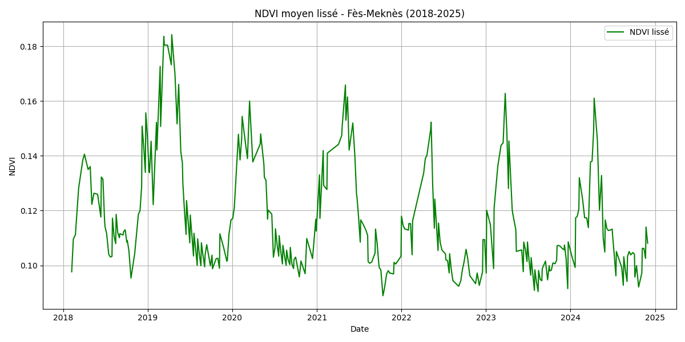
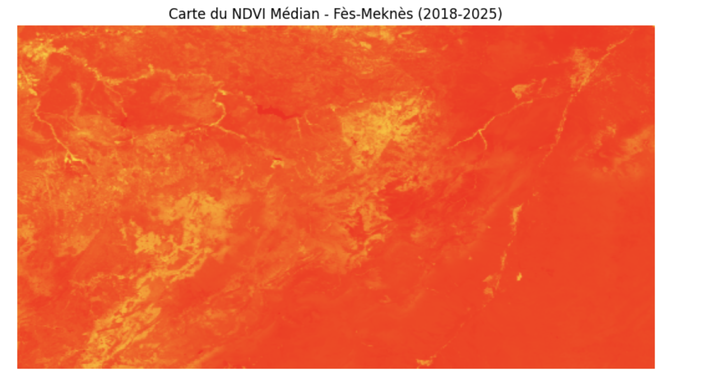
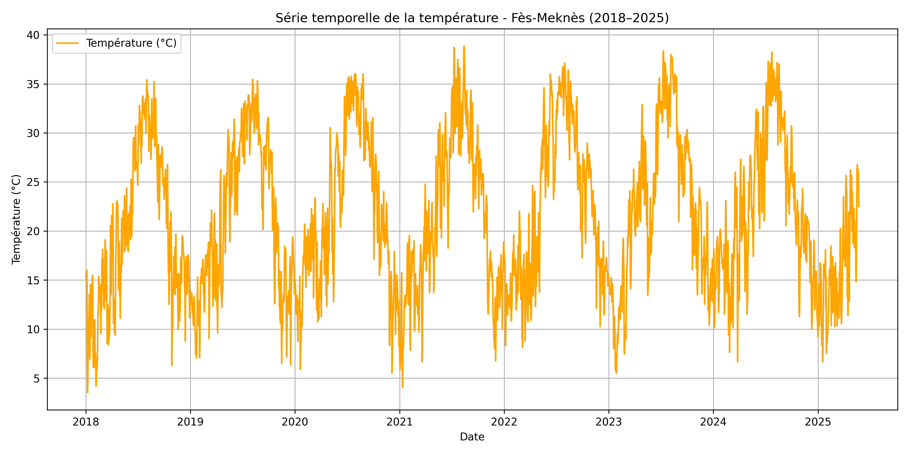
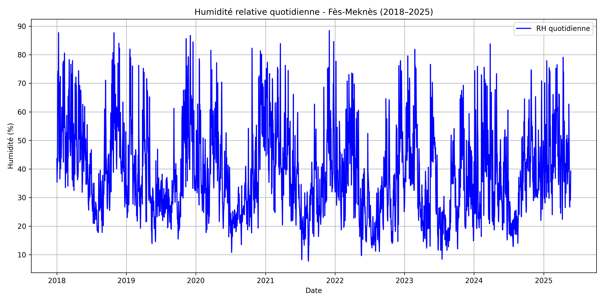
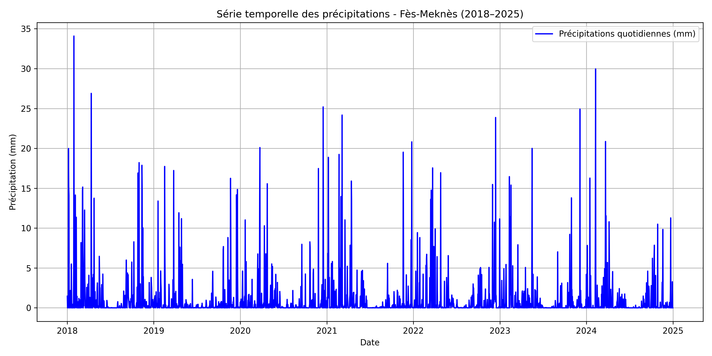
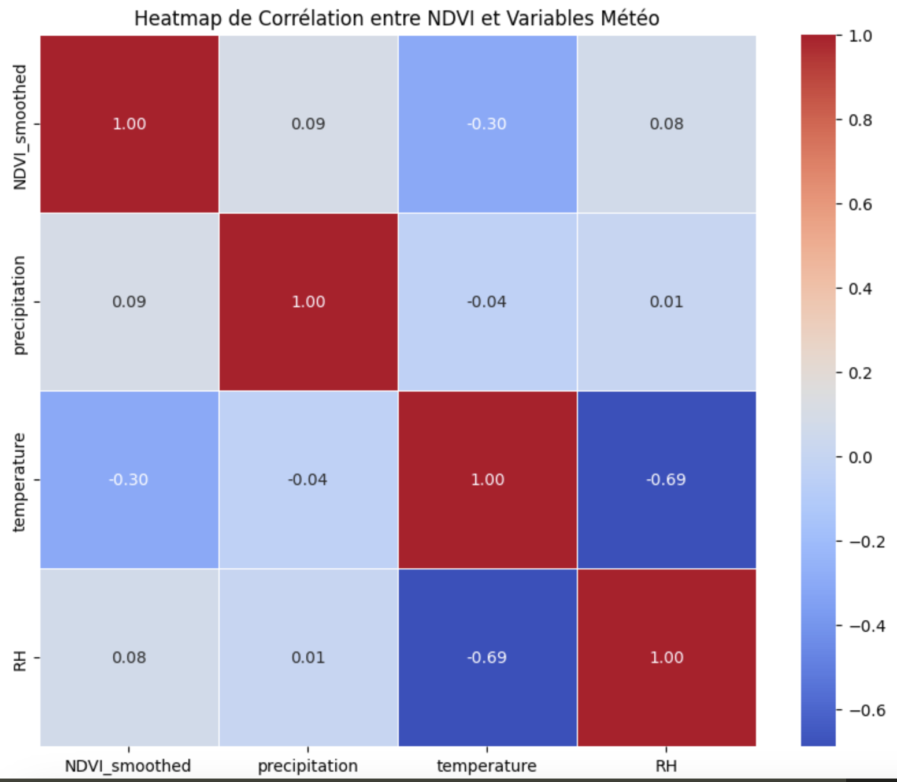

###########################################################
Méthodologie Détaillée : de la Donnée Brute à l'Analyse
###########################################################

Cette page documente de manière exhaustive le processus complet de collecte, de traitement et d'analyse des données agro-climatiques pour la région Fès-Meknès. Chaque étape, depuis l'interrogation des serveurs de Google Earth Engine jusqu'à l'analyse de corrélation temporelle, est détaillée ci-dessous.

**************************************************
Phase 1 : Extraction des Séries Temporelles
**************************************************

Chaque variable a été extraite de la source de données la plus appropriée via l'API Google Earth Engine. Pour chaque variable, la valeur moyenne sur l'ensemble de la région a été calculée pour chaque pas de temps.

1.1. NDVI (Indice de Végétation)
===================================

L'NDVI est un indicateur clé de la santé et de la densité de la végétation.

.. code-block:: python

   import ee
   import pandas as pd
   import matplotlib.pyplot as plt
   from tqdm import tqdm

   # ... (Initialisation et ROI) ...

   # Fonction pour calculer le NDVI moyen pour chaque image
   def get_ndvi_feature(image):
       ndvi = image.normalizedDifference(["SR_B5", "SR_B4"]).rename("NDVI")
       mean_dict = ndvi.reduceRegion(
           reducer=ee.Reducer.mean(),
           geometry=roi_fes_meknes,
           scale=100,
           maxPixels=1e9
       )
       return ee.Feature(None, {'date': image.date().format(), 'NDVI': mean_dict.get('NDVI')})

   # Chargement et application
   landsat = ee.ImageCollection("LANDSAT/LC08/C02/T1_L2").filterBounds(roi_fes_meknes)...
   ndvi_fc = landsat.map(get_ndvi_feature)

   # ... (Extraction, conversion en DataFrame, lissage et sauvegarde) ...

.. admonition:: Détails Techniques et Fonctions Utilisées

    * **`ee.ImageCollection("LANDSAT/LC08/C02/T1_L2")`** : Accède à la collection d'images Landsat 8 (Surface Reflectance).
    * **`image.normalizedDifference(["SR_B5", "SR_B4"])`** : Calcule le NDVI en utilisant les bandes du proche infrarouge (B5) et du rouge (B4).
    * **`image.reduceRegion(reducer=ee.Reducer.mean(), ...)`** : Calcule la valeur **moyenne** de tous les pixels NDVI à l'intérieur de la région.
    * **`pandas.DataFrame.rolling(window=5).mean()`** : Calcule une moyenne mobile sur 5 jours pour lisser la courbe.

   *Figure 1 : Évolution du NDVI moyen lissé pour la région Fès-Meknès.*

1.2. Carte du NDVI Médian
==========================

Une image composite a été créée en calculant la médiane de toutes les images NDVI.

.. admonition:: Détails Techniques et Fonctions Utilisées

    * **`imageCollection.median()`** : Réducteur qui calcule la valeur médiane de chaque pixel sur l'ensemble des images, créant une image synthétique sans nuages.
    * **`image.getThumbURL({...})`** : Génère une URL vers une image PNG de l'aperçu, avec les couleurs appliquées côté serveur.
    * **`requests` et `Pillow (PIL)`** : Utilisés pour télécharger et ouvrir l'image PNG en Python.

   *Figure 2 : Carte du NDVI médian (2018-2025).*

1.3. Température de l'Air
==========================
La température est extraite des données météorologiques horaires ERA5.

.. code-block:: python

   import ee
   import pandas as pd
   from tqdm import tqdm

   # ... (Initialisation et ROI) ...

   def extract_daily_temp(image):
       date = image.date().format("YYYY-MM-dd")
       temp_c = image.select("temperature_2m").subtract(273.15) # Convertir en °C
       mean_temp = temp_c.reduceRegion(
           reducer=ee.Reducer.mean(),
           geometry=roi_fes_meknes,
           scale=1000, maxPixels=1e9
       )
       return ee.Feature(None, {"date": date, "temperature": mean_temp.get("temperature_2m")})

   for year in range(2018, 2026):
       era5 = ee.ImageCollection("ECMWF/ERA5_LAND/HOURLY") \
           .filterBounds(roi_fes_meknes) \
           .filterDate(f"{year}-01-01", f"{year}-12-31") \
           .filter(ee.Filter.calendarRange(12, 12, 'hour')) \
           .select("temperature_2m")
       temp_fc_year = era5.map(extract_daily_temp)
       # ... (Extraction et conversion en DataFrame) ...

.. admonition:: Détails Techniques et Fonctions Utilisées
    * **`ee.ImageCollection("ECMWF/ERA5_LAND/HOURLY")`** : Accède à la collection de réanalyse climatique ERA5.
    * **`ee.Filter.calendarRange(12, 12, 'hour')`** : Filtre clé qui isole uniquement les données de midi pour chaque jour.
    * **`.select("temperature_2m")`** : Sélectionne la bande de température de l'air à 2 mètres du sol.
    * **`.subtract(273.15)`** : Opération mathématique sur chaque pixel pour convertir la température de Kelvin en degrés Celsius.

   *Figure 3 : Température quotidienne moyenne à midi (°C).*

1.4. Humidité Relative (RH)
===========================
L'humidité relative est dérivée de la température et du point de rosée de la même collection ERA5.

.. code-block:: python

   # ... (Initialisation et boucle annuelle identiques à la température) ...

   def compute_relative_humidity(image):
       temp = image.select("temperature_2m").subtract(273.15)
       dew = image.select("dewpoint_temperature_2m").subtract(273.15)
       # Formule de Magnus pour calculer la pression de vapeur saturante (es) et réelle (ed)
       es = temp.multiply(17.625).divide(temp.add(243.04)).exp()
       ed = dew.multiply(17.625).divide(dew.add(243.04)).exp()
       # Calcul final de l'humidité relative
       rh = ed.divide(es).multiply(100).rename("RH")
       mean_rh = rh.reduceRegion(...) # Réduction spatiale
       return ee.Feature(None, {"date": image.date().format(), "RH": mean_rh.get("RH")})

   # La fonction est ensuite appliquée avec .map() dans la boucle annuelle...

.. admonition:: Détails Techniques et Fonctions Utilisées
    * **`.select(["temperature_2m", "dewpoint_temperature_2m"])`** : Sélectionne les deux bandes nécessaires au calcul.
    * **Formule de Magnus** : L'humidité relative est calculée (`ed / es * 100`) en dérivant d'abord la pression de vapeur saturante (`es`) et la pression de vapeur réelle (`ed`) via une série d'opérations mathématiques (`.multiply()`, `.divide()`, `.exp()`) réalisées directement sur les images par les serveurs GEE.

   *Figure 4 : Humidité relative quotidienne moyenne à midi (%).*

1.5. Précipitations
=====================
Les données de précipitations proviennent de la collection CHIRPS, spécialisée dans le suivi des pluies.

.. code-block:: python

   # ... (Initialisation et ROI) ...

   def extract_daily_precip(image):
       mean_rain = image.reduceRegion(
           reducer=ee.Reducer.mean(),
           geometry=roi_fes_meknes,
           scale=5000, maxPixels=1e9
       )
       return ee.Feature(None, {"date": image.date().format(), "precipitation": mean_rain.get("precipitation")})

   chirps = ee.ImageCollection("UCSB-CHG/CHIRPS/DAILY") \
       .filterBounds(roi_fes_meknes) \
       .filterDate(start_date, end_date) \
       .select("precipitation")
   rain_fc = chirps.map(extract_daily_precip)
   # ... (Extraction et conversion en DataFrame) ...

.. admonition:: Détails Techniques et Fonctions Utilisées
    * **`ee.ImageCollection("UCSB-CHG/CHIRPS/DAILY")`** : Accède aux données journalières de précipitations. La méthodologie d'extraction est directe : filtrage de la collection et application de `reduceRegion` avec une moyenne sur chaque image.
    * **`scale: 5000`** : La résolution native de CHIRPS est d'environ 5km, donc une échelle de 5000 mètres est utilisée pour l'échantillonnage.

   *Figure 5 : Précipitations journalières moyennes (mm).*

**************************************************
Phase 2 : Fusion et Analyse de Corrélation
**************************************************

2.1. Fusion des Données
==========================
Les fichiers `.csv` individuels ont été chargés et fusionnés en un unique DataFrame synchronisé.

.. code-block:: python

   import pandas as pd
   
   df_ndvi = pd.read_csv("ndvi_grouped_smoothed_fes_meknes.csv")
   df_precip = pd.read_csv("serie_precipitation_fes_meknes.csv")
   df_temp = pd.read_csv("serie_temperature_fes_meknes.csv")
   df_rh = pd.read_csv("humidite_relative_fes_meknes.csv")

   # Fusion des DataFrames sur la colonne 'date'
   df_all = pd.merge(df_ndvi, df_precip, on="date", how="inner")
   df_all = pd.merge(df_all, df_temp, on="date", how="inner")
   df_all = pd.merge(df_all, df_rh, on="date", how="inner")

.. admonition:: Détails Techniques et Fonctions Utilisées
    * **`pandas.merge(df1, df2, on="date", how="inner")`** : Combine les tables de données. `how="inner"` garantit que seules les dates où **toutes les variables** sont présentes sont conservées.

2.2. Analyse de Corrélation Directe
====================================
Une matrice de corrélation a été calculée pour quantifier les relations linéaires entre les variables.

.. code-block:: python

   import seaborn as sns

   colonnes_pour_correlation = ['NDVI_smoothed', 'precipitation', 'temperature', 'RH']
   df_pour_correlation = df_all[colonnes_pour_correlation]
   matrice_correlation = df_pour_correlation.corr()
   sns.heatmap(matrice_correlation, annot=True, cmap='coolwarm', fmt=".2f")

.. admonition:: Détails Techniques et Fonctions Utilisées
    * **`DataFrame.corr()`** : Calcule la corrélation de Pearson entre chaque paire de colonnes.
    * **`seaborn.heatmap(...)`** : Crée une visualisation graphique de la matrice de corrélation.

   *Figure 6 : Heatmap des corrélations directes entre les variables.*

2.3. Analyse de Corrélation avec Décalage Temporel (Lag)
===========================================================
Pour analyser l'effet retard de la météo sur la végétation, des variables "décalées" ont été créées.

.. code-block:: python

   df_lag = df_all.copy()
   lags = [15, 30, 45, 60]
   for lag in lags:
       df_lag[f'precipitation_lag{lag}'] = df_lag['precipitation'].shift(lag)
       df_lag[f'temperature_lag{lag}'] = df_lag['temperature'].shift(lag)
       # ... etc.

   matrice_correlation_lag = df_lag.corr()

.. admonition:: Détails Techniques et Fonctions Utilisées
    * **`DataFrame['colonne'].shift(n)`** : Fonction clé qui décale les valeurs d'une colonne de `n` périodes (jours). La nouvelle colonne `precipitation_lag30` contiendra, pour une date donnée, la valeur de précipitation d'il y a 30 jours. Ceci permet de tester si la végétation (NDVI actuel) est mieux corrélée avec la pluie du mois précédent qu'avec la pluie du jour même.

